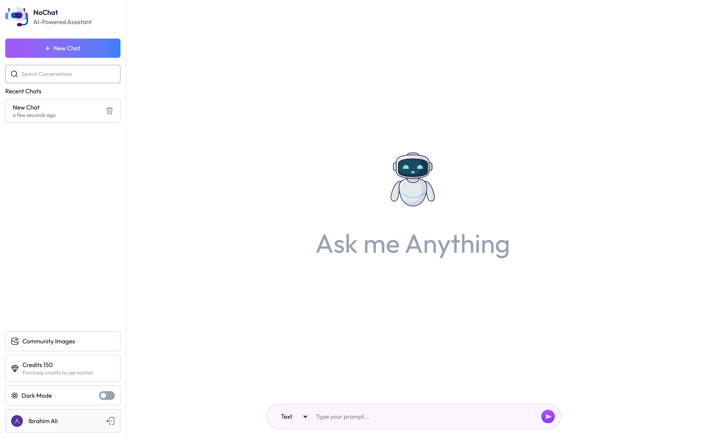

# NoChat

> An all-in-one AI assistant — text chat and AI image generation, powered by a credits system, Stripe billing, and a community gallery.


NoChat is a full-stack AI assistant that combines LLM text chat (via Groq) and AI image generation (via ImageKit) in a single conversational interface. Usage runs on a credit system billed through Stripe hosted checkout with signed webhooks, generated images can be published to a shared community gallery, and email-OTP secures every account. Alongside the React web client, the project includes a companion Expo React Native mobile app.

<p align="center">
  
</p>

## ✨ Features

- 💬 **AI text chat** powered by Groq (Llama 3.1) with per-conversation history context
- 🎨 **AI image generation** via ImageKit, rendered inline in chat
- 🪙 **Credit system** — text messages and image generations consume credits, deducted per request
- 💳 **Stripe billing** — buy credit packs through Stripe hosted checkout, confirmed by signed webhooks (not the redirect URL)
- 🖼️ **Community gallery** — publish your generated images for everyone to browse
- 🗂️ **Multiple chats** — create, list, and delete conversations
- 🔐 **Email-OTP auth** — register, verify OTP, login, and password reset via Nodemailer
- 🚦 **Rate limiting** on the API and JWT-protected routes
- 📱 **Mobile app** — a companion Expo / React Native client with drawer navigation
- 🌗 **Markdown-rendered** assistant responses with syntax highlighting
- ⚡ **Optimistic responses** — replies are returned to the UI before background persistence

## 🛠️ Tech Stack

**Web Client:** React 19, Vite 7, Tailwind CSS 4, React Router 7, Axios, react-markdown, PrismJS, react-hot-toast, Moment

**Backend:** Node.js, Express 5, MongoDB with Mongoose, JSON Web Tokens, bcryptjs, express-rate-limit, Nodemailer, svix

**AI & Services:** Groq SDK (LLM), ImageKit (image generation & hosting), Stripe (payments + webhooks)

**Mobile:** Expo (SDK 54), React Native 0.81, React Navigation, NativeWind, expo-speech, expo-clipboard

## 🚀 Getting Started

### Prerequisites

- Node.js 18+ and npm
- A MongoDB database (local or Atlas)
- A Groq API key
- An ImageKit account (public key, private key, URL endpoint)
- A Stripe account (secret key + webhook signing secret)
- An SMTP email account (for OTP emails)
- Expo CLI / Expo Go (only for the mobile app)

### Installation

```bash
# Clone the repository
git clone <your-repo-url>
cd NoChat

# Install backend dependencies
cd backend
npm install

# Install web client dependencies
cd ../client
npm install

# (Optional) install mobile app dependencies
cd ../mobile
npm install
```

### Environment Variables

Create a `.env` file in `backend/`:

```env
# Core
MONGODB_URI=your_mongodb_connection_string
JWT_SECRET=your_jwt_secret
PORT=3000

# Groq (LLM)
GROQ_API_KEY=your_groq_api_key

# ImageKit (image generation & hosting)
IMAGEKIT_PUBLIC_KEY=your_imagekit_public_key
IMAGEKIT_PRIVATE_KEY=your_imagekit_private_key
IMAGEKIT_URL_ENDPOINT=your_imagekit_url_endpoint

# Stripe (payments)
STRIPE_SECRET_KEY=your_stripe_secret_key
STRIPE_WEBHOOK_SECRET=your_stripe_webhook_secret

# Email (OTP)
EMAIL_USER=your_smtp_user
EMAIL_PASS=your_smtp_password
```

Create a `.env` file in `client/`:

```env
VITE_SERVER_URL=http://localhost:3000
```

### Running Locally

```bash
# Terminal 1 — backend (runs on http://localhost:3000)
cd backend
npm run server       # nodemon, or `npm start` for production

# Terminal 2 — web client (Vite dev server on http://localhost:5173)
cd client
npm run dev

# Terminal 3 — mobile app (optional)
cd mobile
npm start            # Expo dev server
```

Then open **http://localhost:5173** for the web app.

> **Stripe webhooks:** point a Stripe CLI listener (or a public tunnel) at `POST /api/stripe` so credit purchases are confirmed. The endpoint uses the raw request body for signature verification.

## 📁 Project Structure

```
NoChat/
├── backend/
│   ├── configs/          # db, groq, imageKit
│   ├── controllers/       # chat, message, credit, user, webhooks
│   ├── middlewares/       # auth
│   ├── models/            # User, Chat, Transaction
│   ├── routes/            # user, chat, message, credit
│   └── server.js          # Express entry (port 3000)
├── client/
│   ├── src/
│   │   ├── pages/         # Login, Register, Community, Credits, Loading
│   │   ├── components/     # ChatBot, Message, SideBar
│   │   ├── context/        # AppContext
│   │   ├── App.jsx
│   │   └── main.jsx
│   └── vite.config.js
├── mobile/                 # Expo / React Native companion app
├── apk/                    # built Android artifact(s)
└── preview.png
```

---

<p align="center">Built by <b>Syed Ibrahim Ali</b> — Full-Stack &amp; AI Engineer</p>
